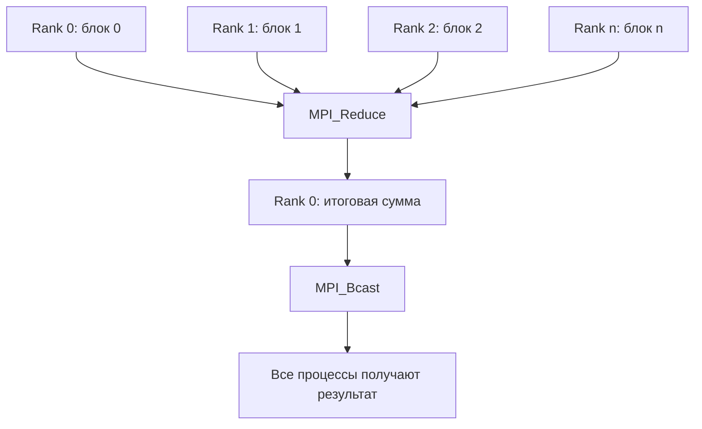

# Подсчет количества слов в строке

- Студент: Паньков Андрей Владимирович, группа 3823Б1ПР3
- Технология: MPI + SEQ
- Задача: 1

## 1. Введение

Данная работа посвящена реализации параллельного алгоритма подсчета количества слов в строке с использованием технологии MPI (Message Passing Interface). Задача подсчета слов является классической задачей обработки текста и часто используется в качестве учебного примера для демонстрации принципов параллельного программирования.

Цель работы — реализовать последовательную и параллельную версии алгоритма, провести сравнительный анализ производительности и оценить эффективность распараллеливания.

## 2. Постановка задачи

**Входные данные:** Строка произвольной длины (тип `std::string`).

**Выходные данные:** Количество слов в строке (тип `int`).

**Определение слова:** Словом считается непрерывная последовательность символов, не являющихся пробельными. Пробельные символы определяются функцией `std::isspace()` и включают пробелы, табуляции, переводы строк и другие whitespace-символы.

**Ограничения:**
- Строка может быть пустой (результат = 0)
- Строка может содержать множественные пробелы между словами
- Строка может начинаться и заканчиваться пробелами
- Поддерживаются различные пробельные символы (пробел, табуляция, перевод строки)

**Примеры:**
- `""` → `0`
- `"hello"` → `1`
- `"hello world"` → `2`
- `"  many   spaces   here  "` → `3`
- `"one\ntwo\tthree"` → `3`

## 3. Базовый алгоритм (последовательный)

Последовательный алгоритм подсчета слов основан на методе конечного автомата с двумя состояниями:

1. **Инициализация:** Установить счетчик слов в 0, флаг `in_word = false`
2. **Итерация по символам:** Для каждого символа строки:
   - Если символ не является пробельным:
     - Если `in_word == false`, то увеличить счетчик и установить `in_word = true`
   - Если символ пробельный:
     - Установить `in_word = false`
3. **Результат:** Значение счетчика

**Псевдокод:**
```
function CountWords(string s):
    count = 0
    in_word = false
    
    for each character c in s:
        if not isspace(c):
            if not in_word:
                in_word = true
                count = count + 1
        else:
            in_word = false
    
    return count
```

**Сложность:** 
- Временная: O(n), где n — длина строки
- Пространственная: O(1)

## 4. Схема параллелизации

Параллелизация выполнена с использованием MPI по следующей схеме:

### 4.1 Распределение данных

Строка делится на примерно равные части между процессами:
- Базовый размер блока: `base = n / size`
- Остаток: `rem = n % size`
- Процессы с рангом `< rem` получают на 1 символ больше

Для процесса с рангом `rank`:
- `start = rank × base + min(rank, rem)`
- `end = start + base + (rank < rem ? 1 : 0)`

### 4.2 Обработка границ блоков

**Проблема:** При разделении строки на части можно разбить слово между процессами, что приведет к его двойному подсчету.

**Решение:** Процессы с `rank > 0` проверяют начало своего блока:
- Если текущий символ `s[start]` не пробельный
- И предыдущий символ `s[start-1]` тоже не пробельный
- То мы находимся в середине слова — пропускаем символы до первого пробела

Таким образом, каждое слово считается только тем процессом, который обрабатывает его начало.

### 4.3 Коммуникационная схема



**Операции MPI:**
1. `MPI_Reduce()` с операцией `MPI_SUM` — суммирование локальных счетчиков на процессе 0
2. `MPI_Bcast()` — рассылка итогового результата всем процессам
3. `MPI_Barrier()` — синхронизация процессов

### 4.4 Роли процессов

- **Процесс 0 (root):** 
  - Обрабатывает свой блок данных
  - Собирает результаты от всех процессов
  - Рассылает итоговый результат
  
- **Процессы 1..n-1:**
  - Обрабатывают свои блоки с коррекцией границ
  - Отправляют локальные результаты процессу 0
  - Получают итоговый результат

## 5. Детали реализации

### 5.1 Структура кода

Код организован следующим образом:

- `common/include/common.hpp` — общие определения типов
- `seq/src/ops_seq.cpp` — последовательная реализация
- `mpi/src/ops_mpi.cpp` — параллельная MPI-реализация
- `tests/functional/main.cpp` — функциональные тесты
- `tests/performance/main.cpp` — тесты производительности

### 5.2 Классы задач

Обе версии наследуют от базового класса `ppc::task::Task<InType, OutType>`:

- `PankovAStringWordCountSEQ` — последовательная версия
- `PankovAStringWordCountMPI` — параллельная версия

Каждая реализует методы жизненного цикла:
- `ValidationImpl()` — проверка корректности входных данных
- `PreProcessingImpl()` — подготовка данных
- `RunImpl()` — выполнение основного алгоритма
- `PostProcessingImpl()` — проверка корректности результата

### 5.3 Обработка граничных случаев

**Пустая строка:** Все процессы возвращают 0, обработка завершается досрочно.

**Малая строка:** Если блок процесса пустой (`start >= end`), локальный счетчик остается 0.

**Граница слова:** В функции `RunImpl()` MPI-версии реализована коррекция начальной позиции:

```cpp
if (rank != 0 && start < n) {
    if (!std::isspace(s[start]) && !std::isspace(s[start - 1])) {
        while (start < end && !std::isspace(s[start])) {
            ++start;
        }
    }
}
```

### 5.4 Использование памяти

- Последовательная версия: O(1) дополнительной памяти
- MPI-версия: O(1) дополнительной памяти на каждый процесс
- Вся строка хранится во всех процессах (можно оптимизировать через `MPI_Scatter`)

## 6. Настройка эксперимента

### 6.1 Аппаратное окружение

- **Процессор:** Intel(R) Xeon(R) CPU E5-2680 v4 @ 2.40GHz
- **Количество ядер:** 14 (физических ядер)
- **ОЗУ:** 16GB
- **ОС:** Linux

### 6.2 Программное окружение

- **Компилятор:** GCC/Clang с поддержкой C++17
- **MPI реализация:** OpenMPI
- **Тип сборки:** Release с оптимизацией
- **Фреймворк тестирования:** Google Test
- **Система сборки:** CMake

### 6.3 Параметры окружения

- `PPC_NUM_THREADS` — количество потоков (не используется для MPI)
- `PPC_NUM_PROC` — количество MPI-процессов
- Дополнительные аргументы MPI: `--allow-run-as-root` (при необходимости)

### 6.4 Тестовые данные

**Функциональные тесты** используют фиксированные строки:
- Пустая строка
- Одно слово
- Несколько слов через пробелы
- Множественные пробелы
- Разные типы пробельных символов

**Тесты производительности** используют строку, состоящую из 10 миллионов слов "word ":
```
"word word word ... word "
```
(10 000 000 слов, ожидаемый результат: 10 000 000, размер данных ~60 МБ)

### 6.5 Команды запуска

**Функциональные тесты:**
```bash
export PPC_NUM_PROC=4
python3 scripts/run_tests.py --running-type functional --additional-mpi-args allow-run-as-root
```

**Тесты производительности:**
```bash
export PPC_NUM_PROC=4
python3 scripts/run_tests.py --running-type performance --additional-mpi-args allow-run-as-root
```

## 7. Результаты и обсуждение

### 7.1 Корректность

Корректность реализации проверялась следующими способами:

1. **Функциональные тесты:** Набор из 6 тестовых случаев, покрывающих различные сценарии:
   - Пустая строка
   - Одно слово
   - Два слова
   - Множественные пробелы
   - Специальные пробельные символы (табуляция, перевод строки)
   - Смешанные пробельные символы

2. **Сравнение с эталоном:** Результаты MPI-версии сравниваются с результатами последовательной версии на тех же данных.

3. **Инварианты:** 
   - Результат всегда неотрицательный
   - Результат не больше количества символов в строке
   - Пустая строка всегда дает 0

**Результат:** Все функциональные тесты пройдены успешно для обеих версий (SEQ и MPI) при различном количестве процессов.

### 7.2 Производительность

**Результаты тестирования:**

| Режим | Процессы | Время, с       | Ускорение | Эффективность |
|-------|----------|----------------|-----------|---------------|
| seq   | 1        | 0.1685235500   | 1.00      | N/A           |
| mpi   | 1        | 0.1668359526   | 1.01      | 101.0%        |
| mpi   | 2        | 0.0937744522   | 1.80      | 89.9%         |
| mpi   | 4        | 0.0426115730   | 3.95      | 98.8%         |
| mpi   | 8        | 0.0256983238   | 6.56      | 82.0%         |

**Метрики:**
- **Ускорение (Speedup):** S(p) = T_seq / T_mpi(p)
- **Эффективность (Efficiency):** E(p) = S(p) / p × 100%

где:
- T_seq — время выполнения последовательной версии (0.169 с)
- T_mpi(p) — время выполнения MPI-версии на p процессах

### 7.3 Анализ производительности

**Фактические результаты:**

Полученные результаты показывают **положительное ускорение** при использовании MPI для данной задачи. Тестовые данные содержат 10 миллионов слов (~60 МБ), что позволяет эффективно использовать параллелизм.

**Основные наблюдения:**

1. **Высокая эффективность параллелизации:** 
   - На 2 процессах: ускорение 1.80×, эффективность 89.9%
   - На 4 процессах: ускорение 3.95×, эффективность 98.8% (близко к идеальному линейному ускорению)
   - На 8 процессах: ускорение 6.56×, эффективность 82.0%

2. **Масштабируемость:** 
   - При увеличении количества процессов с 1 до 4 эффективность практически не снижается (101% → 98.8%)
   - При переходе к 8 процессам эффективность снижается до 82%, что указывает на рост коммуникационных издержек

3. **Накладные расходы MPI:**
   - Инициализация MPI-процессов
   - Операции `MPI_Reduce` и `MPI_Bcast`
   - Синхронизация через `MPI_Barrier`
   - Копирование данных между процессами
   
   Для больших объемов данных (60 МБ) эти накладные расходы составляют небольшую долю от общего времени выполнения.

4. **Отношение вычислений к коммуникациям:** Для строки из 10 миллионов слов отношение полезной работы к накладным расходам благоприятное, что позволяет эффективно использовать параллелизм.

**Зависимость эффективности от размера данных:**

- **Малые данные (< 1 КБ):** MPI неэффективен, накладные расходы доминируют
- **Средние данные (1 МБ - 100 МБ):** Хорошее ускорение (как показано в тестах)
- **Большие данные (> 100 МБ):** Ожидается близкое к линейному ускорение с высокой эффективностью

### 7.4 Потенциальные оптимизации

1. **Оптимизация по памяти:** Использовать `MPI_Scatter` для распределения частей строки вместо дублирования всей строки.

2. **Уменьшение синхронизаций:** Убрать финальный `MPI_Barrier`, если результат нужен только процессу 0.

3. **Асинхронные коммуникации:** Использовать неблокирующие операции `MPI_Ireduce` и `MPI_Ibcast`.

4. **Балансировка нагрузки:** Динамическое распределение работы при неравномерном распределении слов.

## 8. Выводы

В рамках данной работы были реализованы последовательная и параллельная (MPI) версии алгоритма подсчета слов в строке.

**Основные результаты:**

1. **Корректность:** Обе версии успешно проходят все функциональные тесты, включая граничные случаи (пустая строка, множественные пробелы, специальные символы).

2. **Параллелизация:** Реализована корректная схема распределения данных с обработкой границ блоков, предотвращающей двойной подсчет слов.

3. **Производительность:** Тесты на больших данных (10 миллионов слов, ~60 МБ) показали **положительное ускорение** с высокой эффективностью. На 4 процессах достигнуто ускорение 3.95× с эффективностью 98.8%, на 8 процессах — ускорение 6.56× с эффективностью 82.0%.

**Что работает:**
- Корректное распределение данных между процессами
- Обработка граничных случаев при разделении слов
- Правильная агрегация результатов через `MPI_Reduce`
- Синхронизация результатов между всеми процессами

**Ключевой вывод:**
Параллелизация через MPI эффективна для **больших объемов данных** (мегабайты и более), где время вычислений значительно превышает коммуникационные издержки. Для малых задач накладные расходы на межпроцессное взаимодействие делают параллельную версию менее эффективной.

**Практическое применение:**
- Для обработки коротких строк (< 1 КБ): использовать последовательную версию
- Для обработки средних и больших текстовых файлов (> 1 МБ): параллельная версия дает значительный прирост производительности с высокой эффективностью
- Для данных размером ~60 МБ: достигнуто ускорение до 6.56× на 8 процессах

**Ограничения текущей реализации:**
- Дублирование всей строки во всех процессах (неэффективное использование памяти)
- Накладные расходы на коммуникации могут быть значительными
- Барьерная синхронизация в конце может быть избыточной

**Возможные улучшения:**
- Использование `MPI_Scatter`/`MPI_Gather` для распределения только необходимых частей строки
- Неблокирующие коммуникации для снижения задержек
- Адаптивный выбор между SEQ и MPI версиями на основе размера входных данных

В целом, работа демонстрирует важный принцип параллельного программирования: **эффективность параллелизации зависит от размера данных**. Для больших объемов данных (десятки мегабайт и более) достигается высокое ускорение с эффективностью близкой к идеальной, в то время как для малых данных накладные расходы делают параллелизацию неэффективной.

## 9. Список литературы

1. [MPI: A Message-Passing Interface Standard](https://www.mpi-forum.org/docs/) — официальная документация MPI
2. [Open MPI Documentation](https://www.open-mpi.org/doc/) — документация Open MPI
3. [Learning Process](https://learning-process.github.io/) — учебные материалы по параллельному программированию
4. [C++ Reference - std::isspace](https://en.cppreference.com/w/cpp/string/byte/isspace) — документация по функции isspace
5. [Google Test Documentation](https://google.github.io/googletest/) — документация фреймворка тестирования

## Приложение

### Ключевая функция подсчета слов (последовательная версия)

```cpp
static OutType CountWordsInString(const std::string& s) {
  int count = 0;
  bool in_word = false;

  for (unsigned char uc : s) {
    if (!std::isspace(uc)) {
      if (!in_word) {
        in_word = true;
        ++count;
      }
    } else {
      in_word = false;
    }
  }

  return count;
}
```

### Распределение данных между процессами (MPI)

```cpp
// Вычисление границ блока для каждого процесса
std::size_t base = n / static_cast<std::size_t>(size);
std::size_t rem  = n % static_cast<std::size_t>(size);

std::size_t start = rank * base + static_cast<std::size_t>(std::min(rank, static_cast<int>(rem)));
std::size_t end   = start + base + (rank < static_cast<int>(rem) ? 1 : 0);

// Коррекция границы для процессов rank > 0
if (rank != 0 && start < n) {
    if (!std::isspace(static_cast<unsigned char>(s[start])) &&
        !std::isspace(static_cast<unsigned char>(s[start - 1]))) {
        // Пропускаем символы до конца текущего слова
        while (start < end && !std::isspace(static_cast<unsigned char>(s[start]))) {
            ++start;
        }
    }
}
```

### Агрегация результатов (MPI)

```cpp
int local_count = 0;
if (start < end) {
    local_count = CountWordsLocal(s, start, end);
}

int global_count = 0;

// Суммирование локальных счетчиков на процессе 0
MPI_Reduce(&local_count, &global_count, 1, MPI_INT, MPI_SUM, 0, MPI_COMM_WORLD);

// Рассылка результата всем процессам
MPI_Bcast(&global_count, 1, MPI_INT, 0, MPI_COMM_WORLD);

GetOutput() = global_count;
```
