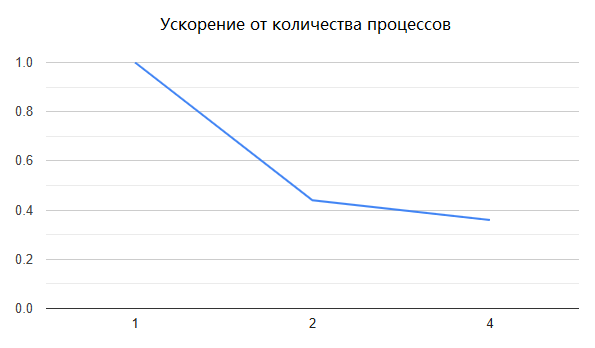
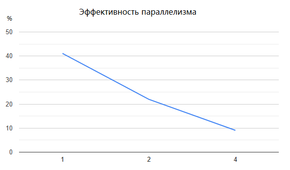

# Сумма элементов матрицы

- Студент: Шакирова Есения Андреевна, группа 3823Б1ПР2
- Технология: SEQ | MPI
- Вариант: 10


## 1. Введение

Вычисление суммы всех элементов матрицы — базовая операция, которая используется во многих прикладных задачах: обработке данных, научных расчётах, анализе информации. Хотя задача и выглядит простой, при работе с большими объёмами данных важно правильно организовать вычисления и распределить нагрузку между процессорами.

В этой работе разработаны последовательный (SEQ) и параллельный (MPI) алгоритмы для подсчёта суммы элементов матрицы. Последовательная версия обрабатывает элементы на одном процессоре, параллельная распределяет данные между процессами с использованием MPI. Обе реализации интегрированы в фреймворк PPC и протестированы.


## 2. Постановка задачи

Дана прямоугольная матрица `A` размера `N × M`, содержащая целые числа. Для данной матрицы требуется вычислить сумму ее элементов.

**Входные данные:** Два целых числа `N` и `M`, задающих соответственно кол-во строк и столбцов матрицы, чисел задающих элементы матрицы `A`: ```size_t rows, size_t cols, std::vector<int64_t> data```;

**Выходные данные:** Целое число: ```using OutType = int64_t``` - сумма всех элементов матрицы.


## 3. Описание алгоритма

### 3.1. Базовый алгоритм (Последовательная версия SEQ)

**Алгоритм работы SEQ-версии:**
1. Проверка корректности входных данных (размеры больше нуля, количество элементов соответствует размерности).
2. Инициализация суммы нулём.
3. Двойной цикл по всем элементам матрицы с накоплением суммы.
```cpp
for (size_t i = 0; i < GetInput().rows; i++) {
    for (size_t j = 0; j < GetInput().cols; j++) {
      GetOutput() += GetInput().At(i, j);
    }
} 
```
4. Сохранение результата в `Output`.

Внешний цикл проходит по строкам, внутренний — по столбцам. Каждый элемент последовательно добавляется к общей сумме.

**Сложность:**
- Временная: O(N * M), где N — количество строк, M — количество столбцов;
- Пространственная: O(1) дополнительной памяти.


### 3.2. Описание параллельного алгоритма (Версия MPI)

**Схема распараллеливания**
Параллельная версия алгоритма основана на декомпозиции матрицы по строкам. Каждый процесс обрабатывает свою часть строк и вычисляет частичную сумму, после чего результаты агрегируются с помощью операции редукции.

**Распределение нагрузки:**
```cpp
size_t rows_per_process = row_count / p_count;
size_t remaining_rows = row_count % p_count;

size_t my_rows = rows_per_process;
if (std::cmp_less(rank, remaining_rows)) {
  my_rows = my_rows + 1;
}
```
Если строки не делятся нацело, остаток распределяется между первыми процессами. Таким образом, разница в количестве обрабатываемых строк между процессами не превышает одной строки.

**Этапы работы параллельного алгоритма:**
- Рассылка метаданных (`MPI_Bcast`) — все процессы получают размеры матрицы
- Распределение данных (`MPI_Scatterv`) — каждый процесс получает свою часть строк
- Локальные вычисления — каждый процесс суммирует свои элементы:
```cpp
   int64_t local_sum = 0;
   for (const auto &value : my_data) {
     local_sum += value;
   }
```
- Агрегация результатов через `MPI_Allreduce` — частичные суммы объединяются в итоговую.

**Сложность:**
- Временная: O((N * M) / P + log P), где P — количество процессов;
  - O((N * M) / P) — время локальных вычислений;
  - O(log P) — время коллективных операций MPI.
- Пространственная: O((N * M) / P) на каждом процессе.


## 4. Детали реализации

Для функциональных тестов входные данные читаются из текстовых файлов, расположенных в каталоге `data/`. Файлы содержат размеры матрицы, её элементы и ожидаемое значение суммы, что позволяет автоматически проверять корректность работы.

Дополнительно механизм загрузки использует абсолютный путь, формируемый через `GetAbsoluteTaskPath`, что гарантирует корректное нахождение тестовых файлов вне зависимости от рабочей директории и обеспечивает воспроизводимость тестов в разных средах исполнения.


## 5. Тестовое окружение

- Аппаратное обеспечение/Операционная система: Intel(R) Core(TM) i5 5200U, 2P+4E ядер, 8Gb Ddr3 1600Mhz, Windows 10, MS-MPI.
- Инструменты сборки: Cmake 4.2.0-rc4, Visual Studio 2022, MSVC, x64 Release.
- Переменные окружения: Использовались настройки по умолчанию. Performance-тесты для MPI запускались с количеством процессов 1, 2 и 4 через `mpiexec`, переменная `PPC_PERF_MAX_TIME` не изменялась.
- Данные: В функциональных тестах использовались вручную подготовленные текстовые файлы из каталога `data/`, содержащие размеры матрицы, её элементы и ожидаемый результат. Для оценки производительности матрица генерируется автоматически в коде (квадратная, фиксированного размера).


## 6. Результаты

### 6.1 Корректность

Корректность работы реализации была подтверждена с помощью набора функциональных тестов, включающих матрицы различного размера и структуры. В тестировании использовались: матрицы с одной строкой и одним столбцом, матрицы, полностью состоящие из нулевых значений, а также прямоугольные (неквадратные) матрицы. Во всех случаях последовательная и параллельная версии давали одинаковый корректный результат.

### 6.2 Производительность

Время, ускорение, эффективность:

| Режим       | Кол-во процессов | Время, сек | Ускорение | Эффективность параллелизма |
|-------------|-------|---------|---------|------------|
| SEQ         | 1     | 0.527  | 1.00    | N/A        |
| MPI         | 2     | 1.199  | 0.44    | 22.0%      |
| MPI         | 4     | 1.450  | 0.36    | 9.1%       |





Проанализировав, мы приходим к тому, что MPI-версия в целом медленнее последовательной, так как операций над данными мало, а основное время тратится на пересылку между процессами.

С ростом числа процессов производительность растёт до 4 MPI-процессов, после чего наблюдается падение ускорения: при 6 процессах и более происходят `bad allocation` (экспериментальным образом выяснилось, что дело не в размерах генерируемой матрицы, а в том, что `Windows MPI` требует выделять большие буферы для `Scatterv` на всех процессах одновременно, что вызывает ошибки распределения памяти).

Таким образом, при небольшом числе процессов можно добиться ускорения относительно последовательной версии, но с увеличением числа процессов эффективность снижается из-за накладных расходов на коммуникацию и ограничения памяти.


## 8. Заключение

Была разработана последовательная и MPI-версия программы для суммирования элементов матрицы. Проведен анализ производительности параллельной реализации: выявлено замедление при росте числа процессов и ошибки bad allocation из-за накладных расходов на пересылку данных и ограничений памяти. На основе экспериментов сделан вывод о целесообразности использования MPI только для небольшого числа процессов для эффективного ускорения.


## 9. Источники

1. Курс лекций "Параллельное программирование" Сысоева Александра Владимировича. 
2. Документация по курсу: https://learning-process.github.io/parallel_programming_course/ru
3. Курс лекций "Параллельная обработка данных": https://parallel.ru/vvv/mpi.html